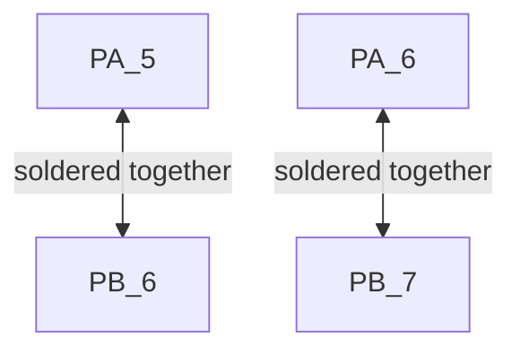

# UOSM-Motor-Controller

Firmware for motor controller.

## TMC API

https://github.com/trinamic/TMC-API

## FreeRTOS priorities

Give each task a different priority level. FreeRTOS can get confused if tasks share a priority level.

## Pin Selection

[Using SPI & Serial -> STM Forum post](https://os.mbed.com/questions/79508/Conflict-between-serial-port-and-spi-on-/)

