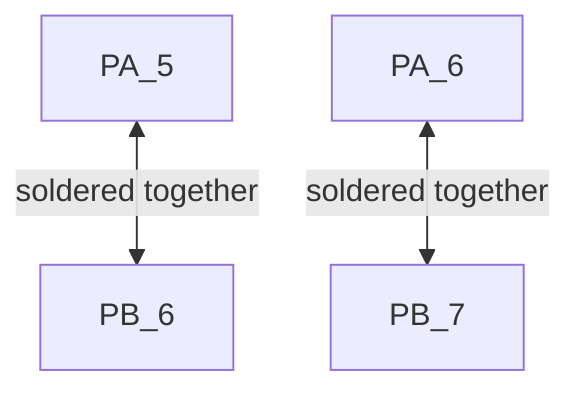

# UOSM-Motor-Controller

Firmware for motor controller.

## TMC API

https://github.com/trinamic/TMC-API

## FreeRTOS priorities

Give each task a different priority level. FreeRTOS can get confused if tasks share a priority level.

## Pin Selection

[Using SPI & Serial -> STM Forum post](https://os.mbed.com/questions/79508/Conflict-between-serial-port-and-spi-on-/)

<table>
<tr>
    <th>MCU Pin</th>
    <th>Software Description</th>
</tr>
<tr>
    <td>PA1</td>
    <td>SPI1_SCK / SPI Serial Clock</td>
</tr>
<tr>
    <td>PA2</td>
    <td>USART2_TX / USART Transmit</td>
</tr>
<tr>
    <td>PA3</td>
    <td>USART2_RX / USART Receive</td>
</tr>
<tr>
    <td>PA6</td>
    <td>SPI1_MISO / SPI Master In Slave Out</td>
</tr>
<tr>
    <td>PA7</td>
    <td>SPI1_MOSI / SPI Master Out Slave In</td>
</tr>
<tr>
    <td>PB0</td>
    <td>Connected to TMC4671's enable pin</td>
</tr>
<tr>
    <td>PB1</td>
    <td>Connected to CAN Bus' Chip Select</td>
</tr>
<tr>
    <td>PB4</td>
    <td>Connected to TMC4671's Chip Select</td>
</tr>
<tr>
    <td>PB5</td>
    <td>Connected to TMC6200's Chip Select</td>
</tr>
<tr>
    <td>PA9</td>
    <td>Connected to TMC6200's enable pin</td>
</tr>
</table>

