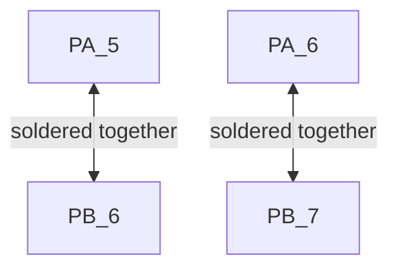

# Hardware Setup

Instructions on how to setup the hardware for running the project.

## Pin Selection

The following table is a reflexion of the pinout that the software is expecting.
This should implement the pinout found in [UOSM's Motor Controller Altium Project](https://americas-uottawa-supermileage-university-of-ottawa.365.altium.com/designs/C21FB5C9-79EE-43FC-82E7-9FBE7B9497B3).

Greyed out rows are not yet implemented in software.

<table>
    <tr>
        <th>MCU Pin</th>
        <th>Software Description</th>
    </tr>
    <tr>
        <td style="color: red">PA1</td>
        <td>SPI1_SCK / SPI Serial Clock</td>
    </tr>
    <tr>
        <td>PA2</td>
        <td>USART2_TX / USART Transmit</td>
    </tr>
    <tr>
        <td>PA3</td>
        <td>USART2_RX / USART Receive</td>
    </tr>
    <tr>
        <td style="color: red">PA6</td>
        <td>SPI1_MISO / SPI Master In Slave Out</td>
    </tr>
    <tr>
        <td style="color: red">PA7</td>
        <td>SPI1_MOSI / SPI Master Out Slave In</td>
    </tr>
    <tr>
        <td>PB0</td>
        <td>Connected to TMC4671 and TMC6200's enable pins</td>
    </tr>
    <tr>
        <td style="color: green">PB1</td>
        <td>Connected to CAN Bus' Chip Select</td>
    </tr>
    <tr>
        <td style="color: green">PB4</td>
        <td>Connected to TMC4671's Chip Select</td>
    </tr>
    <tr>
        <td style="color: green">PB5</td>
        <td>Connected to TMC6200's Chip Select</td>
    </tr>
    <tr>
        <td>PA10 (D0)</td>
        <td>Connected to motor board software fault light LED</td>
    </tr>
    <tr style="background-color: grey">
        <td>PA12 (D2)</td>
        <td>Connected to TMC4671 reset pin (can reset driver without turning motor off)</td>
    </tr>
    <tr style="background-color: grey">
        <td>PA11 (D10)</td>
        <td>Connected to CAN transceiver silent mode pin (drive high to disable CAN)</td>
    </tr>
    <tr style="background-color: grey">
        <td>PA8 (D9)</td>
        <td>Connected to TMC4671 PWM_I pin </td>
    </tr>
    </tr>
    <tr style="background-color: grey">
        <td>PB6 (D5)</td>
        <td>Connected to CAN controller interrupt pin </td>
    </tr>
    <tr style="background-color: grey">
        <td>PA3(A2)</td>
        <td>Connected to backup throttle input </td>
    </tr>
</table>

## Important Extras

The STM32 L432 comes with certain pins connected via solder bridges to retain compatibility with Arduino Uno pinouts

## Useful Articles and Links

[Using SPI & Serial -> STM Forum post](https://os.mbed.com/questions/79508/Conflict-between-serial-port-and-spi-on-/)

[STM32 L432 Pinout](https://os.mbed.com/platforms/ST-Nucleo-L432KC/)
