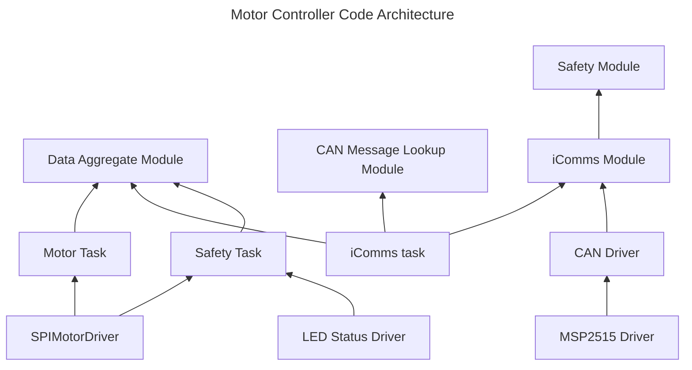

# UOSM-Motor-Controller

Firmware for motor controller.

## Resources

<table>
<tr><th>Name</th><th>Description</th></tr>
<tr>
    <td><a href="https://github.com/trinamic/TMC-API">TMC API</a></td>
    <td>A collection of read/write functions for communicating with the TMC4671 and TMC6200 using SPI</td>
</tr>
</table>
